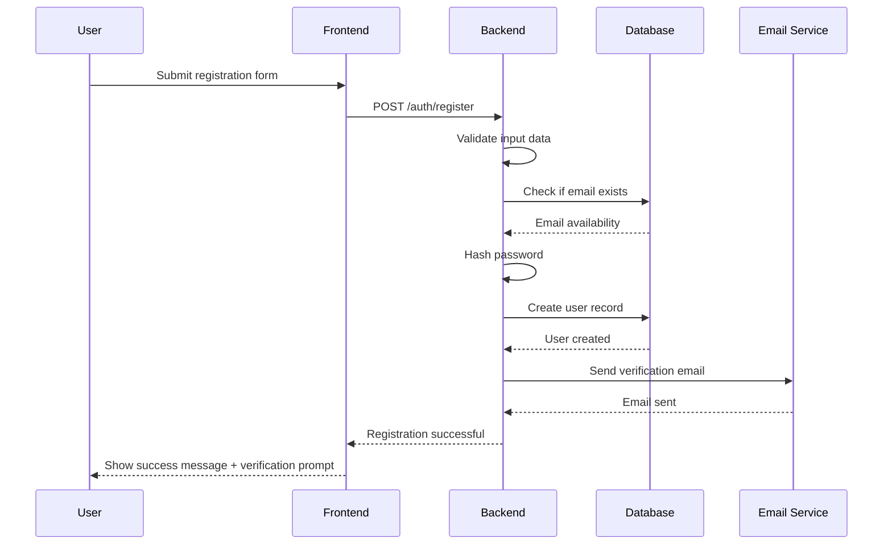
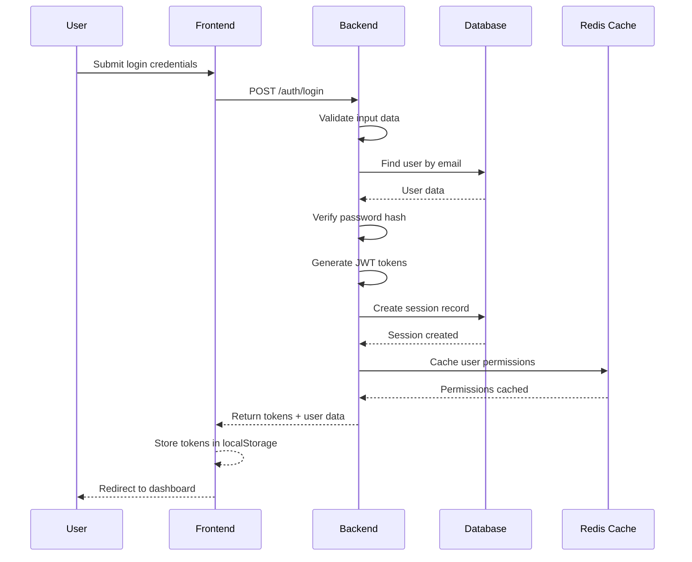
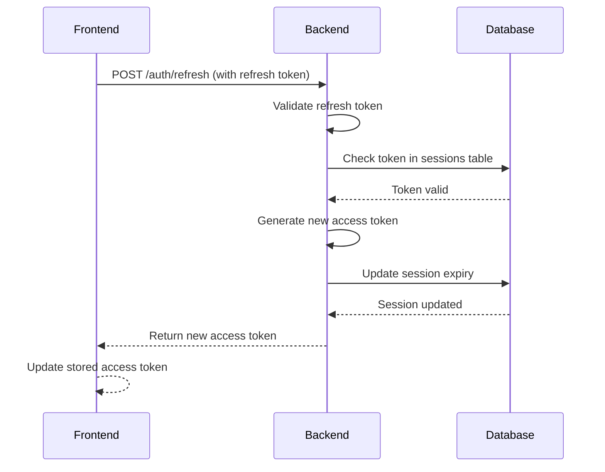
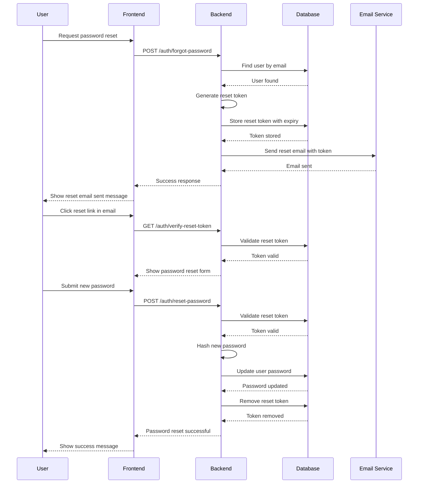
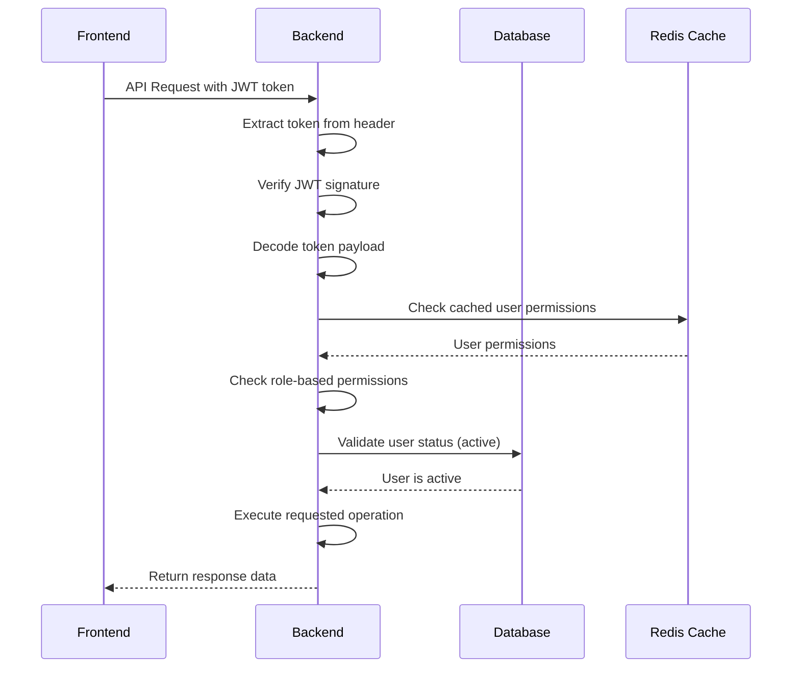

# Authentication and Authorization Flow for Multi-Vendor E-Commerce Platform

## Overview
This document outlines the comprehensive authentication and authorization system for the multi-vendor e-commerce platform, implementing JWT-based authentication with role-based access control (RBAC) for three user types: Customer, Vendor, and Admin.

## Authentication Architecture

### Core Components
1. **JWT Tokens**: Access and refresh token system
2. **Role-Based Access Control**: Three distinct user roles
3. **Session Management**: Secure session handling
4. **Password Security**: Bcrypt hashing with salt
5. **Email Verification**: Account activation system
6. **Password Reset**: Secure password recovery

### User Roles and Permissions

#### 1. Customer Role
**Permissions:**
- Browse and search products
- View product details and reviews
- Add products to cart and wishlist
- Place orders and track status
- Manage personal profile
- Write product reviews
- View order history
- Apply coupons

**Restricted Actions:**
- Cannot access vendor or admin dashboards
- Cannot modify products or orders
- Cannot view other users' data

#### 2. Vendor Role
**Permissions:**
- All customer permissions
- Create and manage own products
- View and manage own orders
- Access vendor dashboard and analytics
- Update vendor profile and settings
- View earnings and payout history
- Manage product inventory
- Respond to customer inquiries

**Restricted Actions:**
- Cannot access admin dashboard
- Cannot manage other vendors' products
- Cannot modify system settings
- Cannot view other vendors' earnings

#### 3. Admin Role
**Permissions:**
- All vendor and customer permissions
- Access admin dashboard and analytics
- Manage all users (customers and vendors)
- Approve/reject vendor applications
- Manage product categories
- Create and manage coupons
- View system-wide analytics
- Manage system settings
- Moderate reviews and content

**Restricted Actions:**
- None (full system access)

## Authentication Flow Diagrams

### User Registration Flow



### User Login Flow



### Token Refresh Flow



### Password Reset Flow



### API Request Authorization Flow



## Authorization Middleware Architecture

### Authentication Middleware

```typescript
// middleware/auth.ts
export const authenticate = async (req, res, next) => {
  try {
    const token = extractTokenFromHeader(req);
    const decoded = verifyJWT(token);
    const user = await getUserById(decoded.userId);

    if (!user || !user.isActive) {
      throw new AuthenticationError('Invalid or inactive user');
    }

    req.user = user;
    next();
  } catch (error) {
    next(new AuthenticationError('Authentication failed'));
  }
};
```

### Role-Based Authorization Middleware

```typescript
// middleware/role-check.ts
export const requireRole = (...roles) => {
  return (req, res, next) => {
    if (!req.user) {
      return next(new AuthenticationError('Authentication required'));
    }

    if (!roles.includes(req.user.role)) {
      return next(new AuthorizationError('Insufficient permissions'));
    }

    next();
  };
};

// Usage examples
app.get('/admin/users', authenticate, requireRole('admin'), getUsers);
app.post('/products', authenticate, requireRole('vendor', 'admin'), createProduct);
app.get('/orders', authenticate, getOrders); // Any authenticated user
```

### Resource Ownership Middleware

```typescript
// middleware/ownership-check.ts
export const requireOwnership = (resourceType) => {
  return async (req, res, next) => {
    const resourceId = req.params.id;
    const userId = req.user.id;

    let isOwner = false;

    switch (resourceType) {
      case 'product':
        const product = await Product.findById(resourceId);
        isOwner = product.vendorId === userId || req.user.role === 'admin';
        break;
      case 'order':
        const order = await Order.findById(resourceId);
        isOwner = order.userId === userId;
        break;
      case 'vendor':
        isOwner = resourceId === userId.toString() || req.user.role === 'admin';
        break;
    }

    if (!isOwner) {
      return next(new AuthorizationError('Resource access denied'));
    }

    next();
  };
};
```

## Security Measures

### Password Security
- **Hashing Algorithm**: bcrypt with 12 salt rounds
- **Minimum Requirements**: 8 characters, uppercase, lowercase, number, special character
- **Password History**: Prevent reuse of last 5 passwords
- **Account Lockout**: 5 failed attempts lock account for 15 minutes

### JWT Token Security
- **Access Token Expiry**: 15 minutes
- **Refresh Token Expiry**: 7 days
- **Token Storage**: HttpOnly cookies (recommended) or localStorage with encryption
- **Token Blacklisting**: Database tracking of invalidated tokens
- **Secure Headers**: HTTP Strict Transport Security (HSTS), XSS protection

### Session Management
- **Session Expiry**: Automatic logout after 24 hours of inactivity
- **Concurrent Sessions**: Maximum 3 active sessions per user
- **Device Tracking**: IP address and user agent logging
- **Session Invalidation**: Logout from all devices option

### API Security
- **Rate Limiting**: 100 requests per minute per IP
- **CORS Configuration**: Restrict to allowed origins
- **Input Validation**: Comprehensive validation using Joi/Zod
- **SQL Injection Prevention**: Parameterized queries
- **XSS Protection**: Input sanitization and CSP headers

## Permission Matrix

| Feature | Customer | Vendor | Admin |
|---------|----------|--------|-------|
| Browse Products | ✅ | ✅ | ✅ |
| Purchase Products | ✅ | ✅ | ✅ |
| Write Reviews | ✅ | ✅ | ✅ |
| Manage Profile | ✅ | ✅ | ✅ |
| Create Products | ❌ | ✅ | ✅ |
| Manage Own Products | ❌ | ✅ | ✅ |
| View Sales Analytics | ❌ | ✅ | ✅ |
| Manage Categories | ❌ | ❌ | ✅ |
| Manage Users | ❌ | ❌ | ✅ |
| Approve Vendors | ❌ | ❌ | ✅ |
| System Settings | ❌ | ❌ | ✅ |
| View All Analytics | ❌ | ❌ | ✅ |

## Error Handling

### Authentication Errors
```json
{
  "success": false,
  "message": "Authentication failed",
  "error": {
    "code": "AUTH_FAILED",
    "details": "Invalid email or password"
  }
}
```

### Authorization Errors
```json
{
  "success": false,
  "message": "Access denied",
  "error": {
    "code": "INSUFFICIENT_PERMISSIONS",
    "details": "Admin role required"
  }
}
```

### Token Errors
```json
{
  "success": false,
  "message": "Token expired",
  "error": {
    "code": "TOKEN_EXPIRED",
    "details": "Please refresh your token"
  }
}
```

## Database Schema for Authentication

### Users Table
```sql
CREATE TABLE users (
    id SERIAL PRIMARY KEY,
    email VARCHAR(255) UNIQUE NOT NULL,
    password_hash VARCHAR(255) NOT NULL,
    role VARCHAR(20) NOT NULL CHECK (role IN ('customer', 'vendor', 'admin')),
    first_name VARCHAR(100) NOT NULL,
    last_name VARCHAR(100) NOT NULL,
    phone VARCHAR(20),
    is_active BOOLEAN DEFAULT TRUE,
    email_verified BOOLEAN DEFAULT FALSE,
    email_verification_token VARCHAR(255),
    password_reset_token VARCHAR(255),
    password_reset_expires TIMESTAMP WITH TIME ZONE,
    last_login TIMESTAMP WITH TIME ZONE,
    login_attempts INTEGER DEFAULT 0,
    lockout_until TIMESTAMP WITH TIME ZONE,
    created_at TIMESTAMP WITH TIME ZONE DEFAULT CURRENT_TIMESTAMP,
    updated_at TIMESTAMP WITH TIME ZONE DEFAULT CURRENT_TIMESTAMP
);
```

### Sessions Table
```sql
CREATE TABLE sessions (
    id SERIAL PRIMARY KEY,
    user_id INTEGER NOT NULL REFERENCES users(id) ON DELETE CASCADE,
    session_token VARCHAR(255) UNIQUE NOT NULL,
    refresh_token VARCHAR(255) UNIQUE NOT NULL,
    ip_address INET,
    user_agent TEXT,
    expires_at TIMESTAMP WITH TIME ZONE NOT NULL,
    created_at TIMESTAMP WITH TIME ZONE DEFAULT CURRENT_TIMESTAMP,
    CHECK (expires_at > created_at)
);
```

## Implementation Considerations

### Frontend Implementation
```typescript
// lib/auth.ts
export const authService = {
  login: async (credentials) => {
    const response = await api.post('/auth/login', credentials);
    const { token, refreshToken, user } = response.data;

    // Store tokens securely
    localStorage.setItem('accessToken', token);
    localStorage.setItem('refreshToken', refreshToken);
    localStorage.setItem('user', JSON.stringify(user));

    return user;
  },

  logout: async () => {
    await api.post('/auth/logout');
    localStorage.removeItem('accessToken');
    localStorage.removeItem('refreshToken');
    localStorage.removeItem('user');
  },

  refreshToken: async () => {
    const refreshToken = localStorage.getItem('refreshToken');
    const response = await api.post('/auth/refresh', { refreshToken });
    const { token } = response.data;

    localStorage.setItem('accessToken', token);
    return token;
  }
};
```

### Backend Implementation
```typescript
// services/auth-service.ts
export class AuthService {
  async login(email: string, password: string) {
    const user = await User.findByEmail(email);
    if (!user) {
      throw new AuthenticationError('Invalid credentials');
    }

    const isValidPassword = await bcrypt.compare(password, user.passwordHash);
    if (!isValidPassword) {
      await this.handleFailedLogin(user);
      throw new AuthenticationError('Invalid credentials');
    }

    // Reset login attempts on successful login
    await this.resetLoginAttempts(user);

    const tokens = await this.generateTokens(user);
    await this.createSession(user, tokens);

    return { user, ...tokens };
  }

  private async generateTokens(user: User) {
    const accessToken = jwt.sign(
      { userId: user.id, role: user.role },
      process.env.JWT_SECRET,
      { expiresIn: '15m' }
    );

    const refreshToken = jwt.sign(
      { userId: user.id },
      process.env.JWT_REFRESH_SECRET,
      { expiresIn: '7d' }
    );

    return { accessToken, refreshToken };
  }
}
```

## Monitoring and Logging

### Authentication Events
- Successful logins
- Failed login attempts
- Password resets
- Account lockouts
- Token refreshes
- Session expirations

### Security Alerts
- Multiple failed login attempts
- Suspicious IP addresses
- Unusual login patterns
- Token abuse attempts

### Audit Trail
- User role changes
- Permission modifications
- Security policy updates
- System access logs

This comprehensive authentication and authorization system ensures secure, scalable, and user-friendly access control for the multi-vendor e-commerce platform.